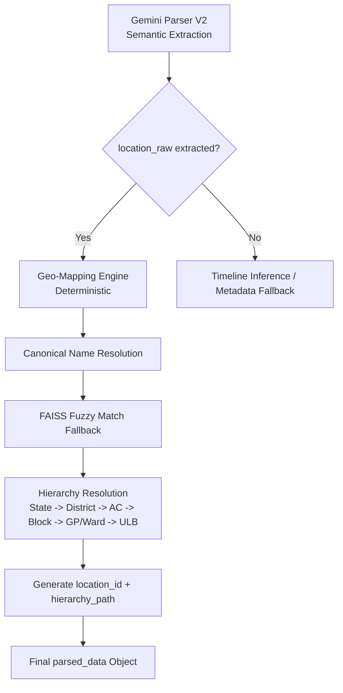

# Golden Standard Regression Testing Framework

## 1. Golden Regression Table (Schema)

| column_name | type | meaning |
|---|---|---|
| tweet_id | string | Twitter ID |
| raw_text | string | Original Tweet Text |
| expected_event_type | string | Canonical event category |
| expected_event_date | date | Parsed date (YYYY-MM-DD) |
| expected_location_raw | string | Location as written in tweet |
| expected_location_type | string | district / city / ulb / village / sector / highway |
| expected_state | string | CG / UP / Bihar / undefined |
| expected_district | string | Canonical District Name |
| expected_assembly_constituency | string/null | Mapped AC |
| expected_block | string/null | Rural hierarchy |
| expected_gp_or_ward | string/null | GP or Ward |
| expected_ulb_name | string/null | ULB Name (e.g., Nagar Nigam Ambikapur) |
| expected_people_handles | string[] | Twitter usernames |
| expected_people_names | string[] | Canonical Hindi names |
| expected_schemes | string[] | Schemes mentioned |
| expected_hashtags | string[] | Hashtags |
| expected_target_groups | string[] | Target groups (Farmers, Youth, etc.) |
| expected_communities | string[] | Communities (Tribal, OBC, etc.) |
| expected_organizations | string[] | Government organizations |
| expected_security_type | string/null | Internal security tag |
| expected_sentiment_political | string/null | Political sentiment |
| notes | string | Notes on ambiguity or edge cases |

## 2. Example Rows (Golden Standard)

| tweet_id | raw_text | expected_event_type | expected_location_raw | expected_district | expected_ulb_name |
|---|---|---|---|---|---|
| 1991470463206527328 | "आज अंबिकापुर में महामहिम राष्ट्रपति..." | धार्मिक / सांस्कृतिक कार्यक्रम | अंबिकापुर | सरगुजा | अंबिकापुर |
| 1991332340204003707 | "जीएसटी भवन का लोकार्पण — सेक्टर-21, नवा रायपुर" | उद्घाटन | सेक्टर-21, नवा रायपुर | रायपुर | नवा रायपुर |
| 1890662244972720535 | "प्रयागराज-मिर्जापुर हाईवे दुर्घटना…" | आपदा / दुर्घटना | प्रयागराज-मिर्जापुर हाईवे | ["प्रयागराज","मिर्जापुर"] | - |
| 1890697226474631322 | "रायगढ़ नगर निगम महापौर चुनाव में…" | चुनाव प्रचार | रायगढ़ नगर निगम | रायगढ़ | रायगढ़ |

## 3. Parsing Pipeline Design (Location → Geo-Mapping)

**Gemini Parser V2 Standard Workflow:**



## 3. Sample Final Parsed Output Structure

```json
{
  "event_type": "उद्घाटन",
  "event_date": "2025-11-19",
  "location_raw": "सेक्टर-21, नवा रायपुर",
  "geo_hierarchy": {
    "state": "छत्तीसगढ़",
    "district": "रायपुर",
    "assembly_constituency": "रायपुर दक्षिण",
    "ulb_name": "NRANVP",
    "location_type": "planned_city",
    "canonical": "नवा रायपुर (अटल नगर)"
  },
  "location_id": "CG-RPR-NRANVP-SECTOR21",
  "people_mentioned": ["..."],
  "schemes_mentioned": ["..."],
  "confidence": 0.97,
  "model_version": "gemini-parser-v2",
  "parsing_trace": {
    "location_source": "geo-mapper-v2",
    "geo_strategy": "exact+faiss",
    "semantic_used": true
  }
}
```

## 4. Regression Testing Workflow

1.  **Fetch**: Load rows from `gold_standard_tweets.csv`.
2.  **Run**: Execute Gemini Parser V2 on `raw_text`.
3.  **Compare**: Verify output against expected columns.
    *   `parsed.event_type == expected_event_type`
    *   `parsed.location_raw` contains `expected_location_raw`
    *   `parsed.geo_hierarchy.district == expected_district`
    *   `parsed.geo_hierarchy.ulb_name == expected_ulb_name`
    *   `people_mentioned` ⊇ `expected_people_names`
    *   `schemes_mentioned` ⊇ `expected_schemes`
4.  **Report**: Pass/Fail status for each row and overall accuracy score.
